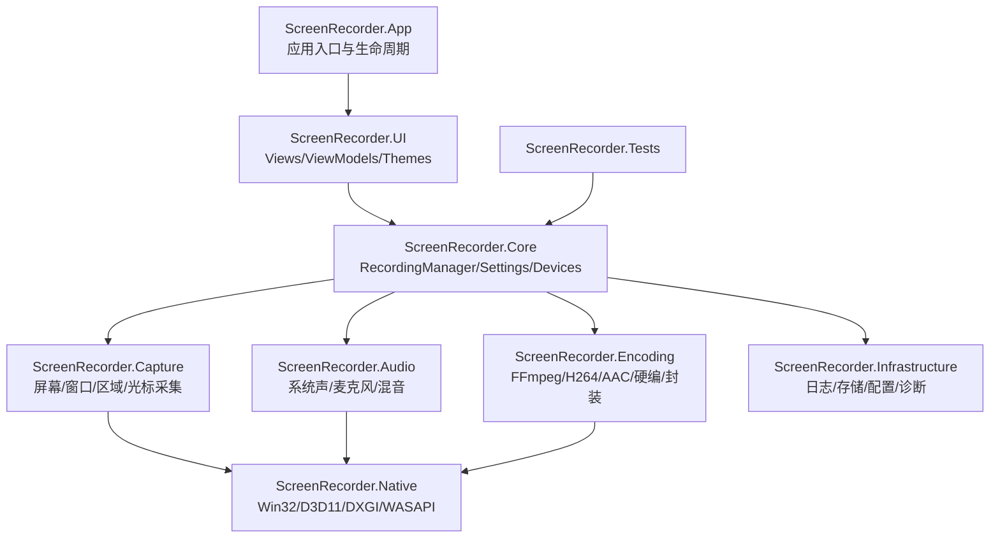
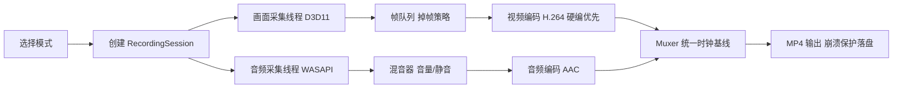

# Inkframe

> 轻量级、高性能的现代化 Windows 桌面录屏工具——以液态玻璃视觉语言，重新定义录屏体验。

---

## 项目简介

市面上的 Windows 录屏工具长期两极分化：一端是 OBS 这类强大但学习成本高的"工程控制台"，另一端是 Bandicam 这类界面停留在十年前审美的传统软件。普通办公用户、教学录制者和自媒体创作者真正需要的，是一款**打开即用、界面现代、长时间稳定**的录屏工具。

Inkframe（代号 ScreenRecorder）为此而生。它基于 WPF + MVVM 构建，底层直连 Windows.Graphics.Capture、Direct3D 11 与 WASAPI，优先调度 GPU 硬件编码（NVENC / Quick Sync / AMF），在 1080P 60FPS 下保持低 CPU 占用；同时以 Apple 式克制 + Liquid Glass 空间层级的设计语言，提供远超传统录屏软件的视觉与交互体验。

**目标用户**：普通办公用户、教学录制用户、自媒体用户、软件演示人员、测试人员。

---

## 核心能力

### 三种录制模式

- **功能**：全屏录制、指定窗口录制、自定义区域录制，支持多显示器与 DPI 感知
- **解决的问题**：不同场景需要不同的画面范围，且窗口/区域选择必须精准
- **价值**：一次框选即可开录，区域选择器支持像素级微调

### 系统声音 + 麦克风双轨采集

- **功能**：WASAPI Loopback 采集系统声音，WASAPI Capture 采集麦克风，独立开关、独立音量、实时混音
- **解决的问题**：录制网课/会议时既需要电脑声音也需要讲解人声
- **价值**：音频设备热插拔自动检测，断开时不中断录制，音画严格同步

### GPU 硬件编码加速

- **功能**：H.264 + AAC → MP4，优先 NVENC / Intel QSV / AMD AMF，异常时自动回退软件编码
- **解决的问题**：1080P 60FPS 软编码会让 CPU 长期满载、系统卡顿
- **价值**：录制过程流畅不掉帧，支持长时间稳定录制

### 录制状态悬浮窗与全局快捷键

- **功能**：迷你悬浮条实时显示时长、录制红点、暂停/停止控制；全局快捷键控制开始/暂停/停止
- **解决的问题**：录制中切换窗口后无法操作主界面
- **价值**：全屏演示、游戏录制场景下不离开当前窗口即可控制录制

### 暂停与继续

- **功能**：录制中可随时暂停，恢复后时间轴无缝衔接，输出单一完整文件
- **解决的问题**：传统工具暂停需要分段录制再手动合并
- **价值**：录制容错率大幅提升

### 录制历史管理

- **功能**：自动记录每次录制的文件、时长、参数，支持快速定位、打开目录、删除
- **解决的问题**：录制产物散落各处难以管理
- **价值**：录制闭环的最后一环，录完即得

---

## 效果展示

<!-- TODO: 添加主界面 / 区域选择器 / 悬浮录制条截图或 GIF -->

打开软件 → 选择录制模式 → 框选区域 → 配置画质/FPS/音频 → 开始录制 → 停止 → 自动入库

---

## 应用场景

- **在线教学**：全屏 + 系统声音 + 麦克风，录制 60FPS 流畅网课
- **软件演示**：窗口录制精准锁定演示程序，悬浮窗控制不干扰演示画面
- **会议留存**：区域录制聚焦共享屏幕区域，暂停功能跳过茶歇
- **Bug 复现**：全局快捷键一键开录，录制历史快速回溯交付测试
- **自媒体内容**：超清画质 + 鼠标高亮，输出即用 MP4 素材

---

## 安装部署

### 环境要求

- Windows 10 (1809+) / Windows 11
- .NET 8 SDK 或更高版本
- （可选）支持硬件编码的 GPU：NVIDIA（NVENC）/ Intel（QSV）/ AMD（AMF）

### 从源码构建

git clone https://github.com/mrye111/Inkframe.git
cd Inkframe
dotnet restore
dotnet build -c Release

构建产物位于 ScreenRecorder.App/bin/Release/ 目录，直接运行 ScreenRecorder.exe 即可。

> 项目处于早期开发阶段，安装包（MSIX / 便携 zip）将随 V1.0 发布提供。

---

## 快速开始

git clone https://github.com/mrye111/Inkframe.git
cd Inkframe
dotnet run --project ScreenRecorder.App

启动后：选择录制模式 → 框选区域（区域模式）→ 点击录制按钮 → 倒计时结束自动开录。

---

## 使用说明

### 录制流程

1. **选择模式**：首页三大卡片——全屏 / 窗口 / 区域
2. **框选目标**：窗口模式自动吸附窗口边界；区域模式支持拖拽 + 方向键像素级微调
3. **配置参数**：分辨率、帧率（24/30/60）、画质（低/标准/高清/超清）、编码器、音频源
4. **开始录制**：主按钮 → 3 秒倒计时 → 悬浮录制条接管控制
5. **结束录制**：悬浮条或快捷键停止 → 自动封装 MP4 → 写入录制历史

### 全局快捷键（默认）

| 快捷键 | 功能 |
|--------|------|
| Ctrl + Alt + R | 开始 / 停止录制 |
| Ctrl + Alt + P | 暂停 / 继续录制 |
| Ctrl + Alt + M | 开关麦克风 |

> 所有快捷键均可在设置页面自定义。

---

## 系统架构

分层架构，共 8 个工程 + 1 个测试工程，依赖单向向下：

| 模块 | 职责 |
|------|------|
| App | 应用入口、DI 容器组装、单实例与托盘生命周期 |
| UI | WPF 视图层：MVVM、液态玻璃主题、动画与自定义控件 |
| Core | 录制编排核心：RecordingManager 状态机、会话模型、设备与设置服务 |
| Capture | 画面采集：Windows.Graphics.Capture 全屏/窗口、区域裁剪、光标合成、帧处理 |
| Audio | 音频采集：WASAPI Loopback / Capture、双轨混音、设备热插拔检测 |
| Encoding | 编码封装：FFmpeg 管道、GPU 硬编抽象（NVENC/QSV/AMF）、MP4 Muxer |
| Native | 原生互操作封装：Win32 / WinRT / COM / Direct3D 11 / DXGI |
| Infrastructure | 横切关注点：Serilog 日志、JSON 配置（含版本迁移）、崩溃保护、诊断 |

---

## 核心工作流程

关键设计：

1. **统一时钟**：音画以同一时间基线打时间戳，保证严格同步
2. **背压与掉帧**：编码跟不上时按策略丢帧，绝不阻塞采集线程、不撑爆内存
3. **崩溃保护**：录制过程分段落盘，进程崩溃后已录内容可恢复
4. **硬件编码回退**：NVENC/QSV/AMF 初始化失败自动降级软编，录制不中断

---

## 技术栈

| 层级 | 技术 | 用途 | 选型理由 |
|------|------|------|---------|
| 语言 | C# / .NET 8 | 主开发语言 | Windows 桌面生态首选 |
| UI | WPF + MVVM | 界面与架构 | 数据绑定成熟，主题/动画能力强 |
| 屏幕采集 | Windows.Graphics.Capture | 全屏/窗口采集 | 官方现代 API，支持硬件加速合成 |
| 图形 | Direct3D 11 / DXGI | 帧处理与传输 | GPU 零拷贝，支撑 60FPS |
| 音频 | WASAPI + NAudio | 系统声/麦克风采集 | Loopback 官方方案，低延迟 |
| 编码 | FFmpeg (H.264/AAC) | 视频音频编码 | 工业标准，硬编插件生态全 |
| GPU 编码 | NVENC / QSV / AMF | 硬件加速编码 | 覆盖三大显卡厂商 |
| 摄像头 | Media Foundation | 摄像头采集（规划） | Windows 原生 |
| 配置 | JSON | 本地配置持久化 | 可读可迁移，支持版本升级 |
| 日志 | Serilog | 结构化日志 | 滚动文件 + 崩溃诊断 |
| DI | Microsoft.Extensions.DependencyInjection | IoC 容器 | 官方库，与 .NET 生态无缝 |

---

## 项目结构

Inkframe/
├── ScreenRecorder.App/              # 应用入口与生命周期
├── ScreenRecorder.UI/               # Views / ViewModels / Controls / Themes
├── ScreenRecorder.Core/             # RecordingManager / Settings / Devices / Services
├── ScreenRecorder.Capture/          # Screen / Window / Region / Cursor / FrameProcessing
├── ScreenRecorder.Audio/            # SystemAudio / Microphone / Mixer / Devices
├── ScreenRecorder.Encoding/         # FFmpeg / H264 / AAC / HardwareEncoder / Muxer
├── ScreenRecorder.Native/           # Win32 / Direct3D / DXGI / WASAPI 互操作
├── ScreenRecorder.Infrastructure/   # Logging / Storage / Configuration / Diagnostics
└── ScreenRecorder.Tests/            # 单元测试

> 需求文档与 UI/UX 设计规范为内部资料，不入库（见 .gitignore）。

---

## 配置说明

配置以 JSON 文件存储于用户目录，支持版本自动迁移。关键配置项：

| 配置项 | 默认值 | 说明 |
|--------|--------|------|
| output.directory | Videos/Inkframe | 录制文件保存目录 |
| video.fps | 30 | 帧率（24/30/60） |
| video.quality | 标准 | 画质档位（低/标准/高清/超清） |
| video.encoder | auto | 编码器（auto 时硬编优先） |
| audio.systemAudio | true | 是否录制系统声音 |
| audio.microphone | false | 是否录制麦克风 |
| hotkeys.* | 见上文 | 全局快捷键绑定 |
| advanced.crashProtection | true | 崩溃保护与分段落盘 |

---

## 性能与扩展性

- **性能目标**：1080P 30FPS 任意主流机器流畅录制；1080P 60FPS 在支持硬编的设备上 CPU 不长期满载
- **瓶颈**：软件编码路径的 CPU 占用 → 通过 GPU 硬编 + 掉帧策略规避
- **内存管理**：帧缓冲池化复用，长时录制内存水位恒定
- **扩展方向**：编码器、采集源均抽象为接口，新增编码格式或采集源无需改动核心编排

---

## 安全设计

- **本地优先**：所有录制与配置数据仅存本地，无任何遥测上传
- **磁盘保护**：开录前检查剩余空间，不足时明确提示并阻止启动
- **设备异常容错**：音频设备断开、GPU 编码异常均有降级路径，录制数据不丢失

---

## 项目亮点

1. **产品创新**：Liquid Glass 空间层级 + 电影感动效，重新定义录屏软件该有的样子——克制、安静、高级
2. **工程创新**：音画统一时钟基线 + 背压掉帧 + 崩溃保护落盘，为"长时间稳定录制"做体系化设计
3. **技术创新**：GPU 硬编三厂商（NVENC/QSV/AMF）统一抽象与自动回退，60FPS 录制的性能天花板

---

## Roadmap

- [x] 产品需求与技术方案设计
- [x] UI/UX 视觉风格规范（Liquid Glass 设计语言）
- [ ] WPF 工程骨架与 MVVM 基础设施
- [ ] 画面采集（全屏/窗口/区域 + 多显示器 + DPI）
- [ ] 音频采集与混音（WASAPI 双轨）
- [ ] FFmpeg 编码管线与 GPU 硬编
- [ ] 悬浮录制条 + 全局快捷键
- [ ] 录制历史与设置页面
- [ ] V1.0 发布（安装包）
- [ ] 摄像头画中画（V1.x）
- [ ] 简单剪辑与标注（V2.0 评估）

---

## 贡献指南

1. Fork 本仓库
2. 创建功能分支：git checkout -b feature/your-feature
3. 提交更改（遵循 Conventional Commits）：git commit -m 'feat: add your feature'
4. 推送分支：git push origin feature/your-feature
5. 提交 Pull Request

代码规范：MVVM 分层职责清晰，Native 互操作统一收敛至 ScreenRecorder.Native，UI 视觉必须遵循内部设计规范。

---

## FAQ

### 为什么不用现成的 OBS？

OBS 是面向专业主播的生产工具，功能强但复杂。Inkframe 面向"打开就录"的普通用户，追求零学习成本与现代体验。

### 支持 Windows 7 吗？

不支持。画面采集依赖 Windows.Graphics.Capture（Windows 10 1809+）。

### 没有独立显卡能录 60FPS 吗？

可以，但会走软件编码路径，CPU 占用较高。建议 30FPS 或降低画质档位。

### 录制文件在哪？

默认保存至 视频/Inkframe 目录，可在设置中修改；录制历史中可一键定位文件。

---

## License

本项目 License 待定，正式发布前补充。<!-- TODO: 选择并添加 LICENSE -->
